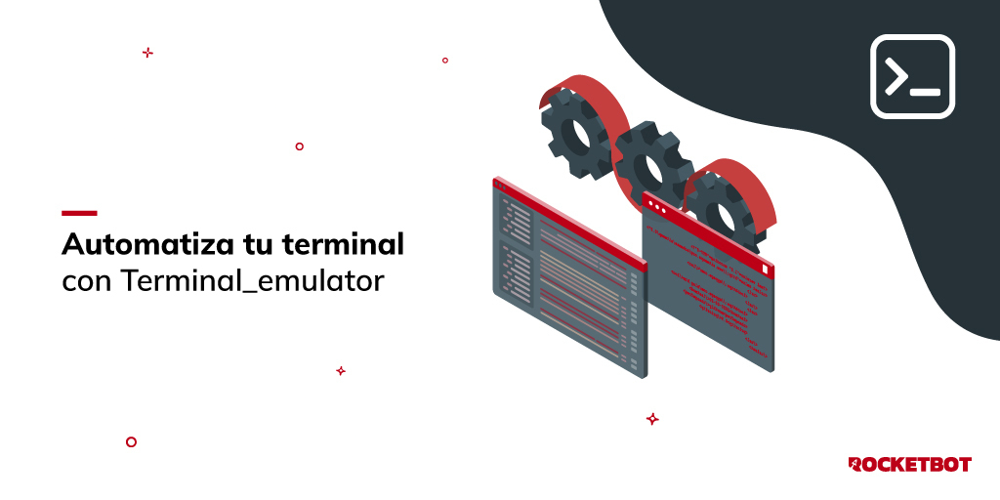

# Terminal Emulator
  
This module allows to perform actions on a terminal emulator, such as connecting, sending text, sending keys, moving the cursor, etc.  

*Read this in other languages: [English](Manual_Terminal_emulator.md), [Português](Manual_Terminal_emulator.pr.md), [Español](Manual_Terminal_emulator.es.md)*
  

## How to install this module
  
To install the module in Rocketbot Studio, it can be done in two ways:
1. Manual: __Download__ the .zip file and unzip it in the modules folder. The folder name must be the same as the module and inside it must have the following files and folders: \__init__.py, package.json, docs, example and libs. If you have the application open, refresh your browser to be able to use the new module.
2. Automatic: When entering Rocketbot Studio on the right margin you will find the **Addons** section, select **Install Mods**, search for the desired module and press install.  

## Description of the commands

### Connect
  
Connect to terminal
|Parameters|Description|example|
| --- | --- | --- |
|Session name||Terminal_1|
|Host||localhost|
|Port||23|
|Terminal type|||
|Safety protocol|||
|Show terminal|If checked, a terminal will be displayed to review robot executions. Development tool.||
|Configuration file||c:/wc3270/conf.ino|
|Variable where to save the result||connected|

### Send Text
  
Send text to the terminal
|Parameters|Description|example|
| --- | --- | --- |
|Session name||Terminal_1|
|Text|Text to send to the termianl|User 1|

### Send Key
  
Send a key or a secuence of keys to Terminal
|Parameters|Description|example|
| --- | --- | --- |
|Session name||Terminal_1|
|Teclas|Keys to send|Hello World|
|Keys|Key to send||
|Cantidad|Number of times to send the key|1|
|Send F key without PA command|Send Program Function (PF) key without Program Attention (PA) key.||

### Move Cursor
  
Move cursor to specific position on Terminal
|Parameters|Description|example|
| --- | --- | --- |
|Session name||Terminal_1|
|Move to position||row,column|
|Direction|Direction to move the cursor to||
|Cantidad|Number of places to move|1|

### Get Text
  
Get text from Terminal
|Parameters|Description|example|
| --- | --- | --- |
|Session name||Terminal_1|
|Variable where to save the result||terminal_text|

### Wait
  
Wait for text on terminal by specific condition
|Parameters|Description|example|
| --- | --- | --- |
|Session name||Terminal_1|
|Wait time|Max waiting time|10|
|Wait by|||
|Text|Text to wait for|Option|
|Variable where to save the result||condition|

### Disconnect
  
Disconnect terminal
|Parameters|Description|example|
| --- | --- | --- |
|Session name||Terminal_1|

### End Session
  
Finish terminal session
|Parameters|Description|example|
| --- | --- | --- |
|Session name||Terminal_1|
