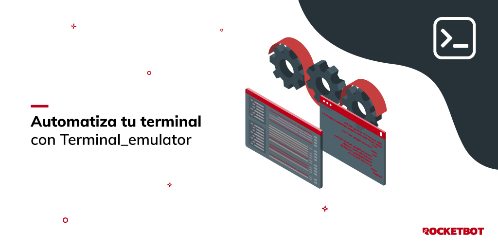

# Terminal Emulator

Este módulo permite realizar ações em um emulador de terminal, como conectar, enviar texto, enviar chaves, mover o cursor, etc.

*Read this in other languages: [English](Manual_Terminal_emulator.md), [Português](Manual_Terminal_emulator.pr.md), [Español](Manual_Terminal_emulator.es.md)*

## Como instalar este módulo

Para instalar o módulo no Rocketbot Studio, pode ser feito de duas formas:
1. Manual: __Baixe__ o arquivo .zip e descompacte-o na pasta módulos. O nome da pasta deve ser o mesmo do módulo e dentro dela devem ter os seguintes arquivos e pastas: \__init__.py, package.json, docs, example e libs. Se você tiver o aplicativo aberto, atualize seu navegador para poder usar o novo módulo.
2. Automático: Ao entrar no Rocketbot Studio na margem direita você encontrará a seção **Addons**, selecione **Install Mods**, procure o módulo desejado e aperte instalar.

## Descrição do comando

### Conectar

Conecta com um terminal
|Parâmetros|Descrição|exemplo|
| --- | --- | --- |
|Nome da sessão||Terminal_1|
|Host||localhost|
|Port||23|
|Tipo de terminal|||
|Modelo de terminal|||
|Protocolo de segurança|||
|Página de código|Especifica a página de códigos EBCDIC para a conexão. O padrão é cp037. Espanhol cp284|cp037|
|Mostrar terminal|Se marcado, um terminal será exibido para revisar execuções do robô. Ferramenta de desenvolvimento.||
|ID da estação de trabalho|Opcional. Identificador único da estação de trabalho para conectar ao servidor AS400. Este valor deve ser registrado e autorizado pelo sistema. Se deixado em branco, um será gerado automaticamente.|BOTWKS01|
|Arquivo de configuração||c:/wc3270/conf.ini|
|Variável onde salvar o resultado||conectado|

### Enviar Texto

Envia texto para o terminal
|Parâmetros|Descrição|exemplo|
| --- | --- | --- |
|Nome da sessão||Terminal_1|
|Texto|Texto para enviar para o terminal|Usuário 1|

### Enviar Tecla

Envia uma tecla ou sequência de teclas para o terminal
|Parâmetros|Descrição|exemplo|
| --- | --- | --- |
|Nome da sessão||Terminal_1|
|Teclas|Teclas para enviar|Olá Mundo|
|Teclas|Tecla para enviar||
|Quantidade|Número de vezes para enviar a tecla|1|
|Enviar tecla F sem comando PA|Enviar tecla de Função de Programa (PF) sem tecla de Atenção de Programa (PA).||

### Mover cursor

Move o cursor
|Parâmetros|Descrição|exemplo|
| --- | --- | --- |
|Nome da sessão||Terminal_1|
|Mover para posição||linha,coluna|
|Direção|Direção para mover o cursor||
|Quantidade|Número de lugares para mover|1|

### Obter Texto

Obtém o texto do terminal
|Parâmetros|Descrição|exemplo|
| --- | --- | --- |
|Nome da sessão||Terminal_1|
|Variável onde salvar o resultado||texto_terminal|

### Esperar

Espera o texto no terminal por uma condição específica
|Parâmetros|Descrição|exemplo|
| --- | --- | --- |
|Nome da sessão||Terminal_1|
|Tempo de espera|Tempo máximo de espera|10|
|Esperar por|||
|Texto|Texto para esperar|Opção|
|Variável onde salvar o resultado||condição|

### Desconectar

Desconecta do terminal
|Parâmetros|Descrição|exemplo|
| --- | --- | --- |
|Nome da sessão||Terminal_1|

### Encerrar sessão

Finaliza a sessão no terminal
|Parâmetros|Descrição|exemplo|
| --- | --- | --- |
|Nome da sessão||Terminal_1|
